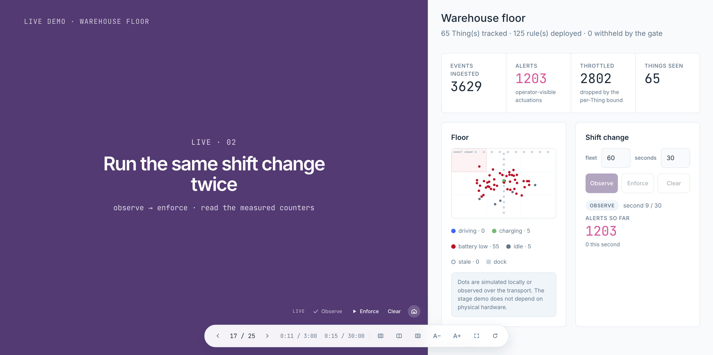

# Goatmire 2026

### Zero Alert Storms: Formal Verification for IoT Automation

A simulation-only demo repository for the Goatmire 2026 talk: a simulated AGV warehouse on the BEAM, a Maude-backed verifier that checks automation rules before they are deployed, and the Phoenix dashboard, notebooks, and scenarios that make every stage beat reproducible from source.

---

[](https://github.com/futhr/goatmire-2026/actions/workflows/quality.yml)
[](https://codecov.io/gh/futhr/goatmire-2026)
[](#license)

---

## The stage presenter



The talk runs from one fullscreen surface at [`/talk`](http://localhost:4000/talk): the deck on the left, the live system on the right, and a scripted step for each demo beat. No window switching, no second tool.

The demo makes one narrow argument: check interacting automation rules **before** deployment, and preserve a third verdict — `unverified` — when the verifier cannot answer. The fleet is simulated; [Maude](https://maude.cs.illinois.edu) performs the conflict check through [ExMaude](https://github.com/futhr/ex_maude); BeamLens turns a bounded telemetry snapshot into an interactive diagnostic answer. Everything shown on stage lives in this repository.

---

## Try it interactively

The teaching notebooks are executable tutorials, not extra documentation pages. They build the Maude mental model from terms to the deployment gate — follow them in order:

Clone the repository and follow [the notebook setup instructions](notebooks/README.md).
Open the files from the clone so their pinned project and model files are available:

- [Terms, equations, and rules](notebooks/01_terms_equations_and_rules.livemd)
- [Conflicts are about composition](notebooks/02_conflicts_are_about_composition.livemd)
- [The deployment gate](notebooks/03_the_deployment_gate.livemd)
- [Different policy, same mechanism](notebooks/04_agent_policy_same_mechanism.livemd)

The five shorter scenarios in `priv/livebooks/` also run in the presenter's embedded notebook pane.

## The deployment gate

`Goatmire.Rules` produces a rule term, `Goatmire.Verifier` passes that term to `ExMaude.IoT`, and `Goatmire.Engine.RuleEval` executes it — one representation with separate model and runtime implementations. Shared data reduces translation risk; tests still need to check their semantic differences. The verifier never turns backend failure into permission:

| Verdict | Meaning | Enforce mode |
|---|---|---|
| `:clean` | No encoded conflict was found in this input | deploy |
| `:conflicts` | At least one encoded conflict has a witness | withhold conflicting rules |
| `:unverified` | The check did not produce a trustworthy answer | deploy nothing |

A clean result is deliberately scoped. It is not a proof of physical safety, temporal correctness, authorization, or any property absent from the model.

---

## What is here

- **Simulation** — supervised AGVs with battery, position, and deadband reporting. No physical device is part of the stage demo or its evidence.
- **Runtime** — an always-on rule engine evaluating the same rule terms passed to the verifier, with per-Thing actuation bounds so an oscillating rule pair degrades noisily instead of melting the node.
- **Research-derived case** — Scenario 1 reproduces the conflict shape of SOTERIA's O3/O4 example: the same `contact=open` event drives one switch both on and off. A controlled reproduction, not a historical incident.
- **Interactive diagnostics** — `/diagnostics` uses BeamLens over a bounded, read-only snapshot. Codex (ChatGPT plan) explains first; Ollama is the local fallback. Neither model decides the formal verdict.
- **Teaching notebooks** — four Livebook tutorials in [`notebooks/`](./notebooks) build the Maude mental model from terms to the deployment gate, plus five stage livebooks in [`priv/livebooks/`](./priv/livebooks).

---

## Quick start

Install Elixir/Erlang and the Maude interpreter, then boot the app:

```bash
mise install                 # or: asdf install
mix setup
mix maude.install            # GPL interpreter; not bundled with ExMaude
docker compose -f docker/docker-compose.diagnostics.yml up -d broker
mix goatmire.health
mix phx.server
```

| Route | What it shows |
|---|---|
| [`/talk`](http://localhost:4000/talk) | the presenter: deck, live panes, timer, scripted steps |
| [`/warehouse`](http://localhost:4000/warehouse) | simulated fleet, floor plan, and storm controls |
| [`/rules`](http://localhost:4000/rules) | rule creation with a bounded asynchronous admission check |
| [`/verify`](http://localhost:4000/verify) | verifier detail — term, verdict, measured cost |
| [`/diagnostics`](http://localhost:4000/diagnostics) | prompt-driven BeamLens diagnostics |
| [`/notebook`](http://localhost:4000/notebook) | the staged livebooks, in the pane the presenter shows |
| [`/metrics`](http://localhost:4000/metrics) | in-app series from the diagnostics sampler |
| [`/beamlens`](http://localhost:4000/beamlens) | advanced BeamLens inspector |

`/` is the warehouse. `/talk/notes` is the speaker's iPad view and needs the
stage credential even on loopback; `make talk-stage` prints its unlock link.
Under `/api`: `GET /api/health` (what `mix goatmire.health` polls),
`POST /api/things/:thing_id/telemetry` for devices that cannot hold an MQTT
session, and the loopback-only diagnostics completion bridge.

The dashboard is styled with Livebook's own design tokens and fonts, so the talk moves between notebook and floor without a visual seam.

For a fully local run, skip Codex and start Ollama with the fixed fallback model:

```bash
ollama pull qwen3.5:4b-q4_K_M
ollama serve
```

The bridge refuses API-key accounts and exhausted or unknown plan quota. Codex still consumes account usage; billing and purchased-credit controls belong to the signed-in account. The dashboard makes the active provider and any fallback reason visible.

---

## IEx-first operation

The application is deliberately usable without the dashboard. Start the prepared shell and use the `GM` alias loaded by [`.iex.exs`](./.iex.exs):

```elixir
make iex
GM.help()
GM.status()
GM.start_fleet(20, tick_ms: 0)
GM.verify()
GM.observe(fleet_size: 20, duration_seconds: 2)
GM.snapshot()
GM.reset()
```

Every helper returns ordinary Elixir terms, so it composes with `dbg/2`, pattern matching, `:observer`, or ad-hoc telemetry handlers. For a running release, use `make remote`.

---

## The five scenarios

```bash
mix goatmire.scenario 1
mix goatmire.scenario 2 --mode observe --fleet 60 --duration 30
mix goatmire.scenario 2 --mode enforce --fleet 60 --duration 30
mix goatmire.scenario 3
```

| # | Beat | Scope |
|---|---|---|
| 1 | SOTERIA-derived contact-open state conflict | exact reproduced rule shape |
| 2 | Synthetic alert-storm load, observe then enforce | measured simulator comparison |
| 3 | Clean rule set | the verifier is not a blanket rejection |
| 4 | Generated rules, verify, revise, verify | optional model beat |
| 5 | One agent policy checked directly | offline formal-method beat |

The stage comparison reads counters from the current run. Rehearsal numbers are never presented as production measurements.

---

## Benchmarks

Do not quote a universal latency. Generate an artifact on the actual talk machine and report its rule count, partitions, considered/skipped pairs, verdict, median, and p95 together:

```bash
mix goatmire.benchmark --runs 10 --output tmp/goatmire-benchmark.json
```

Benchee workloads in [`bench/`](./bench) record distributions, memory, and BEAM reductions separately from pass/fail tests. They are exploratory tools, not gates:

```bash
mix run --no-start bench/rule_eval_bench.exs   # runtime rule evaluation, 20 → 2000 rules
mix run --no-start bench/partition_bench.exs   # interaction partitioning, 25 → 6005 rules
mix run --no-start bench/verifier_bench.exs    # the full gate; needs Maude, parallel: 1
```

Every number they print belongs to one machine, one commit, and one rule corpus. Quote the artifact, never the number alone — see [`bench/README.md`](./bench/README.md).

---

## Repository layout

```text
docs/talk/                 abstract, manuscript, slides, Q&A, sources (CC BY-NC-ND)
docs/runbooks/             demo setup and rehearsal procedure
docs/maude-for-dummies.md  the technical study guide behind the talk
notebooks/                 Livebook tutorials: learn Maude from an Elixir seat
docker/                    broker, simulator, and Livebook support stack
lib/goatmire/engine.ex     observe/enforce deployment semantics
lib/goatmire/verifier.ex   three verdicts, witnesses, and work statistics
lib/goatmire/rules.ex      research-derived and synthetic rule corpus
lib/goatmire/diagnostics/  bounded snapshot, BeamLens skill, Codex/Ollama bridge
```

MQTT carries the host/container stage traffic. HTTP ingress, Modbus, VDA 5050, and declared-device adapters are off-stage integration examples; they make no hardware support or protocol conformance claim.

---

## Configuration

This is a fixed local demonstration, so most settings are checked in: [`config/config.exs`](./config/config.exs) holds fleet, model, timeout, and diagnostic defaults; [`config/dev.exs`](./config/dev.exs) selects the host MQTT demo; [`docker/config/`](./docker/config) configures the container roles. `config/runtime.exs` reads the stage host and rotating token, plus an optional session signing key. There is no `.env` loader or API-key configuration.

---

## Verification

```bash
mix check --no-retry         # the canonical repository gate
mix test --include maude     # the default suite plus live-interpreter tests
```

`mix check` runs warning-free compilation and docs, formatting, strict Credo, Doctor, Sobelow, dependency and secret audits, coverage, Dialyzer, the OTP release, and the Compose topology. Focused lanes (property, E2E, stress, LLM) and the reasoning behind the coverage policy are described in [`docs/testing.md`](./docs/testing.md).

---

## What this is not

This is not a production platform or a physical-fleet benchmark. State is in-memory; the support broker is anonymous; the simulated devices are not a model of a particular vehicle; and the formal result covers only encoded conflict predicates. The dashboard is local by default; LAN access requires the current stage credential. Speaker notes require that credential on loopback too. Broker, optional Livebook, metrics, and Ollama are local support services without application authentication. Use a trusted machine and a private stage network.

---

## License

The **software** is MIT licensed ([LICENSE](./LICENSE)); run it, study it, build on it. The **talk material** under [`docs/talk/`](./docs/talk) — manuscript, slides, narrative, Q&A — is [CC BY-NC-ND 4.0](./docs/talk/LICENSE.md): published for transparency, not for re-delivery. The separately installed Maude interpreter is GPL.
